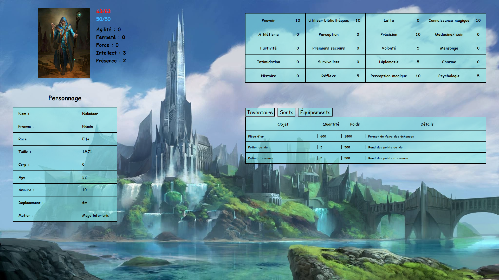
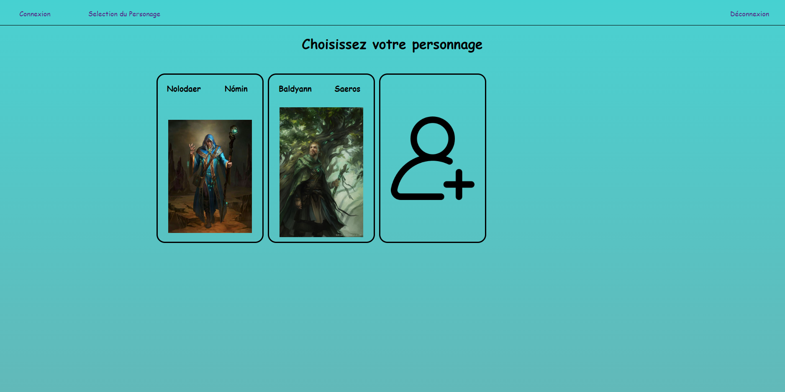

# rpg-manager

Cette application web aura pour but de pouvoir créer un personnage et y asssocier un inventaire, des statistiques et des sorts pour compléter un jeu de role papier.
Il s'agira principalment d'une interface interactif qui mettra à disposition toutes les informations utile d'un personnage.

Pour l'intant les sorts, statisques ... sont liés à des règles scpécifiques et ne sont pas encore personalisable.

Quelques images de ce que ça propose (Il y aura bien évidament un évolution graphique pour la page de connexion, selection... pour l'intant je me concentre sur le fonctionnel)

Le projet n'est pas fini ni même réel utilisable, mais vous pouvez tout de même en avoir un aperçu.

Techno requise :
- NodeJs (npm)

Télécharger le projet et éxécuter le script "Install-start-rpg-manager.bat" poyr télécharger les dépendances puis un fois de ltéléchargement terminé, exucuter le seconde script
"start-rpg-manager.bat" pour lancer l'application web, la base de donnée et l'API (bdd et API géré par strapi). Ensuite vous devrez vous créer un compte sur strapi à l'addresse "http://localhost:1337/admin/auth/login" pour pouvoir vous connecter avec l'application et créer votre premier personnage et avoir un aperçu.
De cette manière il n'y aura aucune données en base de données il faudra donc également créer des sorts, objets... et les liés à votre personnage (pas de panique cela arrivera dans le future).
